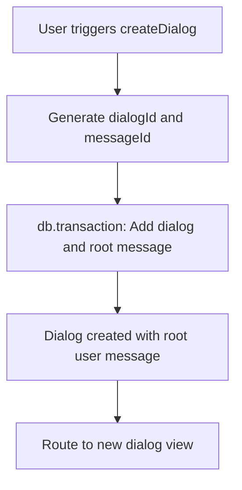
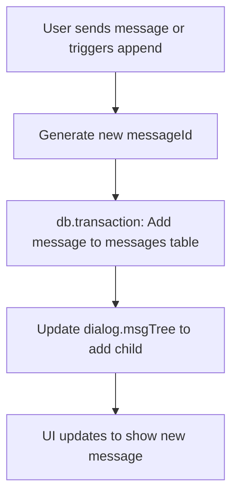
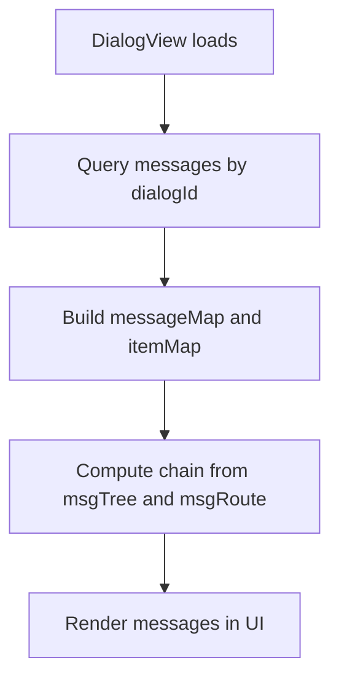
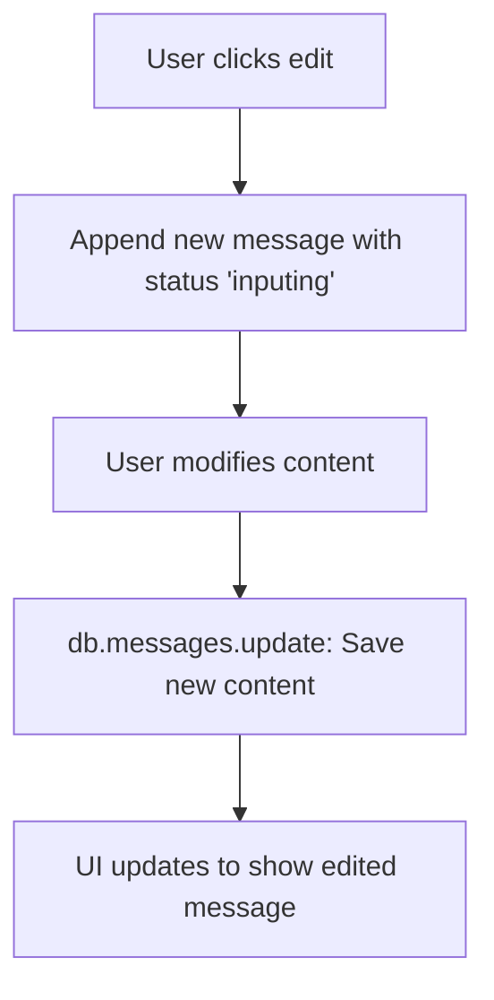
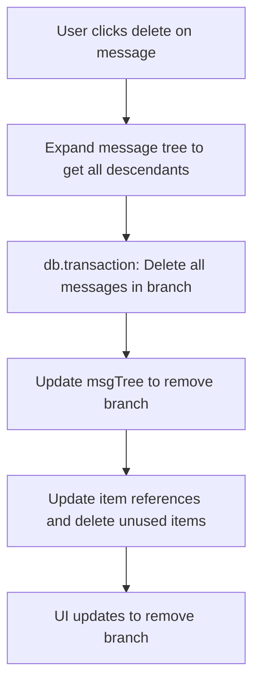

# Dialog Message CRUD Patterns

This document describes how dialog messages are created, read, updated, and deleted (CRUD) in the application, with workflow diagrams and code examples.

---

## 1. Create

### Dialog Creation
- **File:** `src/composables/create-dialog.ts`
- **Pattern:**
  - A new dialog is created with a root user message.
  - Both dialog and its first message are created in a single Dexie transaction.
  - The dialog's `msgTree` is initialized as `{ $root: [messageId], [messageId]: [] }`.
  - The dialog is then navigated to.

**Workflow:**


**Code Example:**
```ts
// src/composables/create-dialog.ts
async function createDialog(props: Partial<Dialog> = {}) {
  const id = genId()
  const messageId = genId()
  await db.transaction('rw', db.dialogs, db.messages, () => {
    db.dialogs.add({
      id,
      workspaceId: workspace.value.id,
      name: t('createDialog.newDialog'),
      msgTree: { $root: [messageId], [messageId]: [] },
      msgRoute: [],
      assistantId: workspace.value.defaultAssistantId,
      inputVars: {},
      ...props
    })
    db.messages.add({
      id: messageId,
      dialogId: id,
      type: 'user',
      contents: [{ type: 'user-message', text: '', items: [] }],
      status: 'inputing'
    })
  })
  router.push(`/workspaces/${workspace.value.id}/dialogs/${id}`)
}
```

---

### Message Creation (Append)
- **File:** `src/views/DialogView.vue` (`appendMessage`)
- **Pattern:**
  - A new message is added as a child to a target message in the dialog's `msgTree`.
  - The message is added to the `messages` table.
  - The dialog's `msgTree` is updated to include the new message as a child of the target.

**Workflow:**


**Code Example:**
```ts
// src/views/DialogView.vue
async function appendMessage(target, info: Partial<Message>, insert = false) {
  const id = genId()
  await db.transaction('rw', db.dialogs, db.messages, async () => {
    await db.messages.add({
      id,
      dialogId: dialog.value.id,
      workspaceId: dialog.value.workspaceId,
      ...info
    } as Message)
    const d = await db.dialogs.get(props.id)
    const children = d.msgTree[target]
    const changes = insert ? {
      [target]: [id],
      [id]: children
    } : {
      [target]: [...children, id],
      [id]: []
    }
    await db.dialogs.update(props.id, {
      msgTree: { ...d.msgTree, ...changes }
    })
  })
  return id
}
```

---

## 2. Read

- **Pattern:**
  - Messages are read by querying all messages with the current dialog's `dialogId`.
  - The message tree (`msgTree`) and route (`msgRoute`) are used to compute the current visible message chain.
  - The UI renders messages in the order defined by the chain.

**Workflow:**


**Code Example:**
```ts
// src/views/DialogView.vue
const liveData = useLiveQueryWithDeps(() => props.id, async () => {
  const [dialog, messages, items] = await Promise.all([
    db.dialogs.get(props.id),
    db.messages.where('dialogId').equals(props.id).toArray(),
    db.items.where('dialogId').equals(props.id).toArray()
  ])
  return { dialog, messages, items }
}, { initialValue: { dialog: null, messages: [], items: [] } })

const messageMap = computed<Record<string, Message>>(() => {
  const map = {}
  liveData.value.messages.forEach(m => { map[m.id] = m })
  return map
})
```

---

## 3. Update

### Edit Message
- **File:** `src/views/DialogView.vue` (`edit`), `src/components/MessageItem.vue`
- **Pattern:**
  - User triggers edit on a message.
  - A new message is appended as a child of the target, with the same content but status `inputing`.
  - The user can then modify the content and save.

**Workflow:**


**Code Example:**
```ts
// src/views/DialogView.vue
async function edit(index) {
  const target = chain.value[index - 1]
  const { type, contents } = messageMap.value[chain.value[index]]
  switchChain(index - 1, dialog.value.msgTree[target].length)
  await db.transaction('rw', db.dialogs, db.messages, db.items, () => {
    appendMessage(target, {
      type,
      contents,
      status: 'inputing'
    })
    const content = contents[0] as UserMessageContent
    saveItems(content.items.map(id => itemMap.value[id]))
  })
  await nextTick()
  focusInput()
}

// src/views/DialogView.vue
async function updateInputText(text) {
  await db.messages.update(chain.value.at(-1), {
    contents: [{
      ...inputMessageContent.value,
      text
    }]
  })
}
```

---

## 4. Delete

### Delete Message Branch
- **File:** `src/views/DialogView.vue` (`deleteBranch`)
- **Pattern:**
  - User triggers delete on a message.
  - All descendant messages (the branch) are recursively collected.
  - All messages in the branch are deleted from the `messages` table.
  - Associated items are reference-counted and deleted if no longer used.
  - The dialog's `msgTree` is updated to remove the branch.

**Workflow:**


**Code Example:**
```ts
// src/views/DialogView.vue
async function deleteBranch(index) {
  const parent = chain.value[index - 1]
  const anchor = chain.value[index]
  const branch = dialog.value.msgRoute[index - 1]
  branch === dialog.value.msgTree[parent].length - 1 && switchChain(index - 1, branch - 1)
  const ids = expandMessageTree(anchor)
  const itemIds = ids.flatMap(id => messageMap.value[id].contents).flatMap(c => {
    if (c.type === 'user-message') return c.items
    else if (c.type === 'assistant-tool') return c.result || []
    else return []
  })
  await db.transaction('rw', db.dialogs, db.messages, db.items, () => {
    db.messages.bulkDelete(ids)
    itemIds.forEach(id => {
      let { references } = itemMap.value[id]
      references--
      references === 0 ? db.items.delete(id) : db.items.update(id, { references })
    })
    const msgTree = { ...toRaw(dialog.value.msgTree) }
    msgTree[parent] = msgTree[parent].filter(id => id !== anchor)
    ids.forEach(id => {
      delete msgTree[id]
    })
    db.dialogs.update(props.id, { msgTree })
  })
}
```

---

## 5. Other Patterns

- **Regenerate:** Similar to edit, but triggers a new assistant response for a given message.
- **Quote/Extract Artifact:** Allows quoting or extracting parts of messages as new items or artifacts.

---

## Summary Table

| Operation | Function(s) / File(s)         | Description |
|-----------|-------------------------------|-------------|
| Create    | `createDialog`, `appendMessage` | New dialog or message, updates `msgTree` |
| Read      | `useLiveQueryWithDeps`, computed chain | Query messages by dialogId, build chain |
| Update    | `edit`, `updateInputText`     | Edit message, update content |
| Delete    | `deleteBranch`                | Delete message branch, update `msgTree` and items |

---

## Data Structures

- **Dialog**
  - `msgTree: Record<string, string[]>` — Tree of message IDs.
  - `msgRoute: number[]` — Path through the tree for the current chain.
- **Message**
  - `id, dialogId, type, contents, status, ...`

---

## Visual Summary

- **Dialog = Tree of Messages**
- **CRUD = Add/Remove/Update nodes in the tree, update Dexie tables, and update UI accordingly.**
