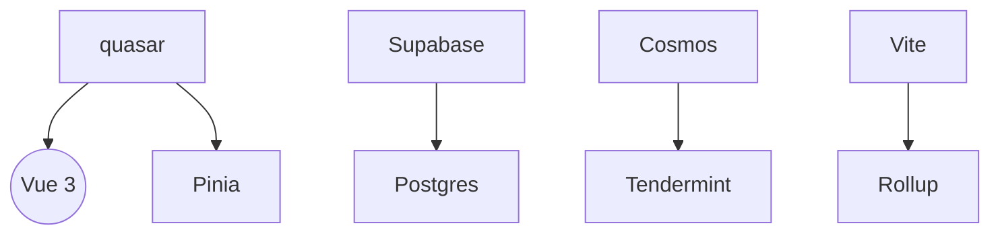

# Technology Context

## Core Stack
| Category        | Technologies              |
|-----------------|---------------------------|
| UI Framework    | Vue 3 + Quasar            |
| State Management| Pinia                     |
| Security        | WebCrypto + AES-GCM       |
| Storage         | IndexedDB + Supabase      |
| Blockchain      | Cosmos SDK                |
| Testing         | Jest + Testing Library    |
| Build           | Vite 4+                   |

## Key Dependencies

## Development Practices
- Atomic component design
- Composable-driven architecture
- End-to-end encryption by default
- Automated type generation (scripts/generate-types.js)
