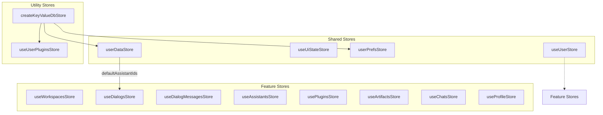
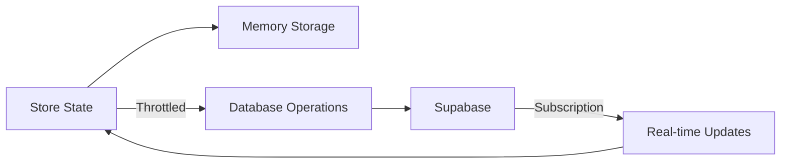
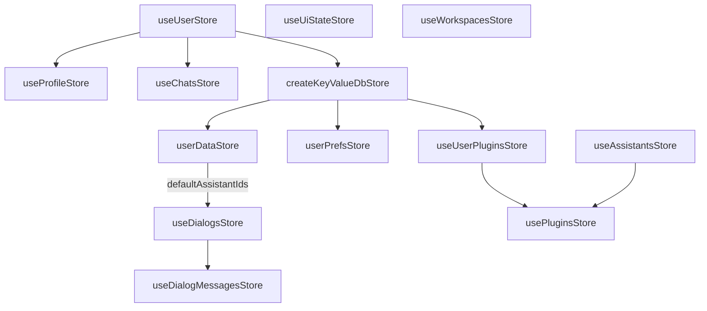
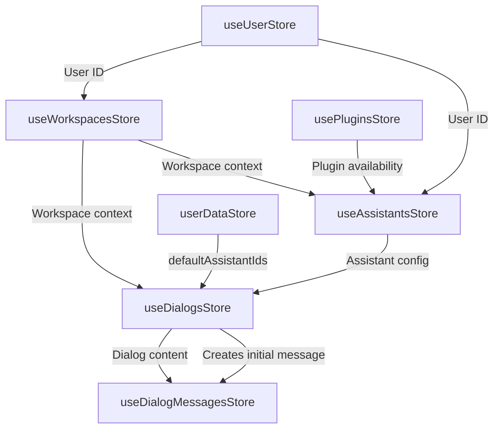
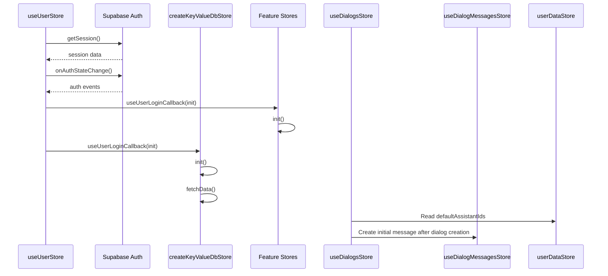
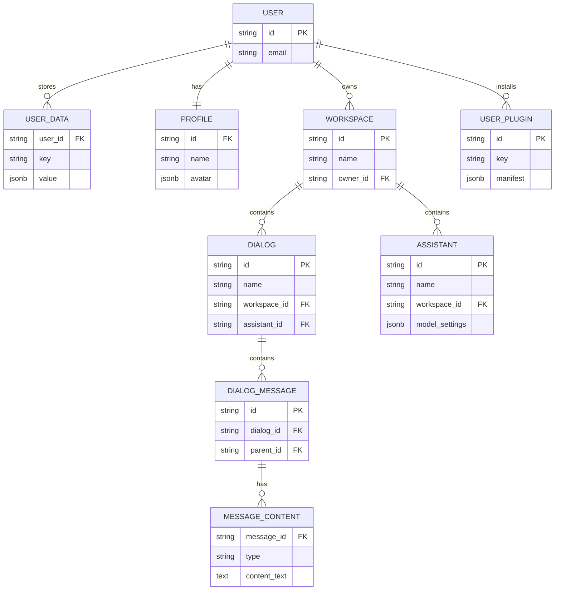

# Store Relationship Diagrams

This document provides visual representations of the relationships between stores in the AIaW application.

## Store Types and Organization

## State Persistence Flow

## Core Store Dependencies

## Data Flow Between Stores

## Store Initialization Flow

## Store Database Relationships

---

**Note:**
- When creating a dialog, `useDialogsStore` reads the default assistant ID for the workspace from `userDataStore` (key: `defaultAssistantIds`).
- After a dialog is created, an initial message is immediately created in `useDialogMessagesStore`.
- This flow ensures every new dialog starts with a message branch, ready for user input.
