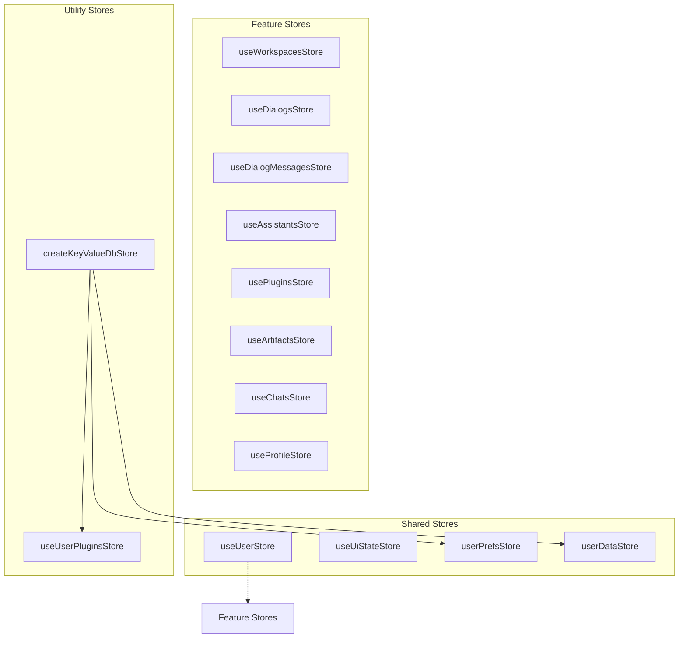
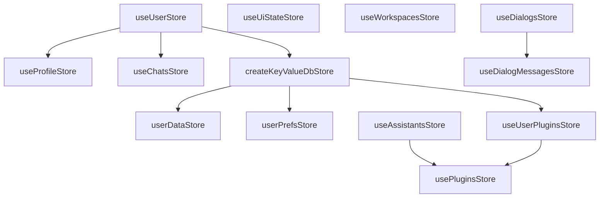
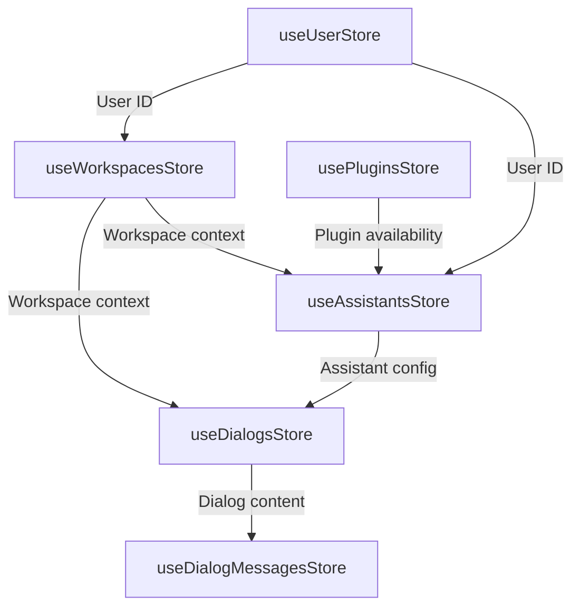
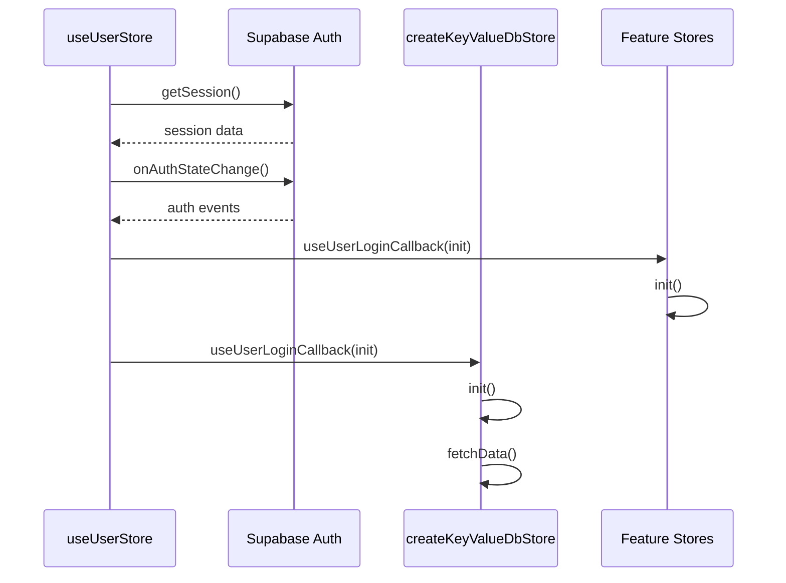
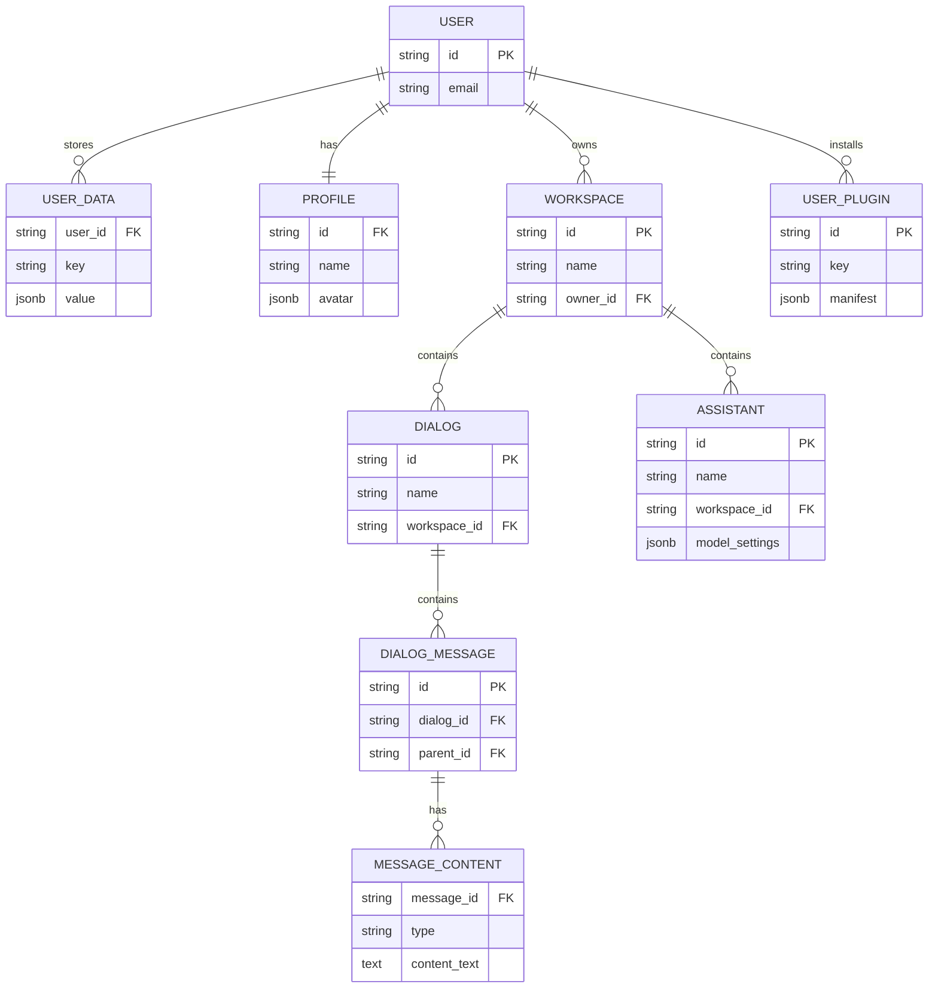

# Store Relationship Diagrams

This document provides visual representations of the relationships between stores in the AIaW application.

## Store Types and Organization

## State Persistence Flow

## Core Store Dependencies

## Data Flow Between Stores

## Store Initialization Flow

## Store Database Relationships

