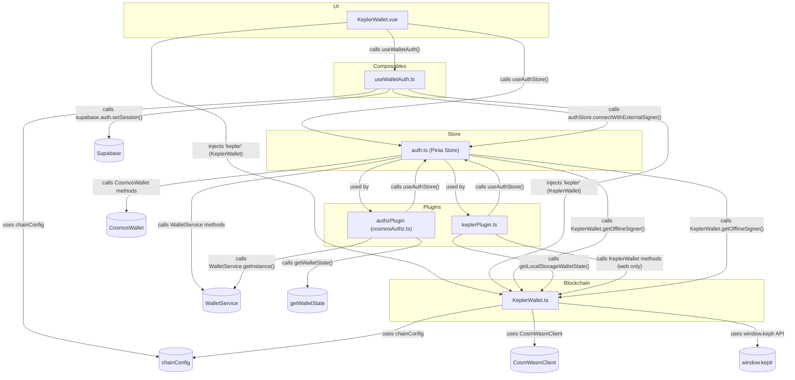

# Auth Module

## Overview

The Auth module handles user authentication and authorization within the AIaW application. It provides secure login/logout mechanisms, session management, and access control for various parts of the application.

## Directory Structure

```
auth/
├── components/        # UI components for authentication
├── composables/       # Functional composition utilities
├── store/             # Pinia store for authentication state
├── utils/             # Utility functions for authentication
└── views/             # Page-level components for auth pages
```

## Key Files

- `composables/useAuth.ts`: Core authentication functionality
- `composables/useCheckLogin.ts`: Login state verification
- `composables/useMnemonic.ts`: Mnemonic phrase handling for crypto
- `composables/useUserLoginCallback.ts`: Post-login callback handling
- `store/auth.ts`: Authentication state management
- `components/AuthDialog.vue`: Authentication interface
- `components/MnemonicDialog.vue`: Mnemonic phrase interface

## Architecture Diagram

Below is a diagram showing the relationships between the main files of the Auth module (including blockchain wallet integration) and their dependencies:



**Diagram explanation:**
- Arrows are labeled with the type of interaction (function call, injection, API usage, etc).
- External dependencies (Supabase, chainConfig, WalletService, etc.) are shown as separate nodes.
- This diagram helps to understand how UI, composables, store, plugins, and blockchain logic are interconnected in the authentication and wallet flow.

## Responsibilities

- Managing user authentication flows
- Handling login and registration
- Managing authentication tokens
- Providing secure password handling
- Supporting various authentication methods
- Handling authorization and permissions
- Managing user sessions
- Offering UI components for authentication

## Authentication Methods

The module supports multiple authentication methods:

- Email/password authentication
- Wallet-based authentication (blockchain)
- OAuth providers (optional)
- PIN-based authentication for quick access

## Dependencies

The Auth module integrates with several other modules:

- **Profile**: For user profile information
- **Blockchain**: For wallet-based authentication
- **Workspaces**: For workspace access control
- **Settings**: For auth-related settings

## Security Features

The module implements several security measures:

- Secure token storage
- Token refresh mechanisms
- Session timeout handling
- PIN encryption
- Mnemonic phrase management

## Usage Examples

### Authentication Check

```typescript
import { useCheckLogin } from '@/features/auth/composables';

const { isLoggedIn, checkLoginState } = useCheckLogin();
await checkLoginState();

if (isLoggedIn.value) {
  // User is authenticated
} else {
  // Redirect to login
}
```

### User Login

```typescript
import { useAuth } from '@/features/auth/composables';

const { login } = useAuth({
  loading: isLoading,
  onComplete: handleLoginComplete
});

await login(email, password);
```

### Handling First Visit

```typescript
import { useFirstVisit } from '@/features/auth/composables';

const { isFirstVisit, completeFirstVisit } = useFirstVisit();

if (isFirstVisit.value) {
  // Show onboarding
  await completeFirstVisit();
}
```

### Managing PIN Authentication

```typescript
import { usePinModal } from '@/features/auth/composables';

const { showPinModal, verifyPin } = usePinModal();
showPinModal();

// When pin is entered
const isValid = await verifyPin(enteredPin);
```

## Flow Diagram

```
User Input → Authentication Request →
Token Generation → Session Creation →
Profile Loading → Workspace Access →
Authenticated State
```
